### The project is an e-commerce system affiliated with two more individual organisations (entities). An E-commerce organization that showcases products to the users, a supplier supplies the products that are currently available to supplier and lastly a bank organization which will manage and keep the transactions among these three organizations.

</br></br>
**Run this project**</br>

### 1. Configure **.env** file:

open a .env file in your root directories and set the env variables. open a cluster and create 3 collection named bank, ecom, seller

```
NODE_ENV = development
PORT = <ecommerce api port>
PORT_BANK = <bank api port>
PORT_SELLER = <seller api port>
MONGO_URI = <ecommerce connection string>
MONGO_URI_BANK = <bank connection string>
MONGO_URI_SELLER = <seller connection string>
JWT_SECRET_ECOM = <secret string>
JWT_SECRET_SELLER = <secret string>
```

### 2. Install the packages in root package,json

```
npm i
```

### 3. Install the package.json for frontend_ecom.

Go to frontend_ecom

```
cd frontend_ecom
```

Then

```
npm i
```

### 4. Install the package.json for frontend_seller.

Go to frontend_seller

```
cd frontend_seller
```

Then

```
npm i
```

### 5. Install the package.json for frontend_bank.

Go to frontend_bank

```
cd frontend_bank
```

Then

```
npm i
```

### 6. Set up the data for the bank in postman first

go to root directory, then run

```
npm run dev
```

## Voila your project is running

### Frontend Screenshots

## Ecommerce:

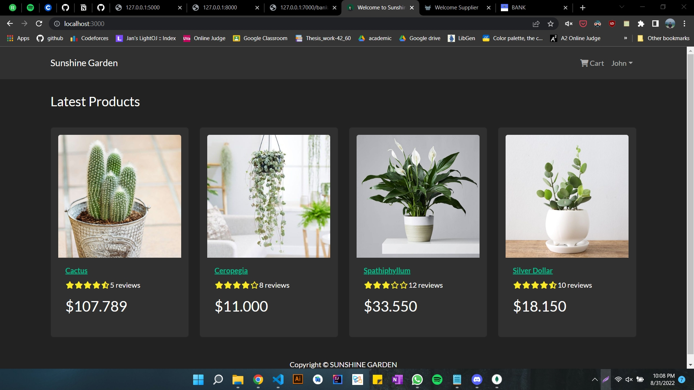
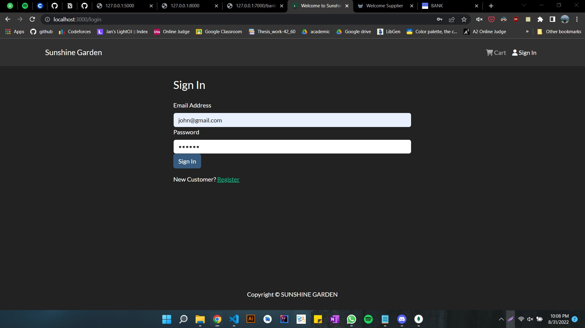
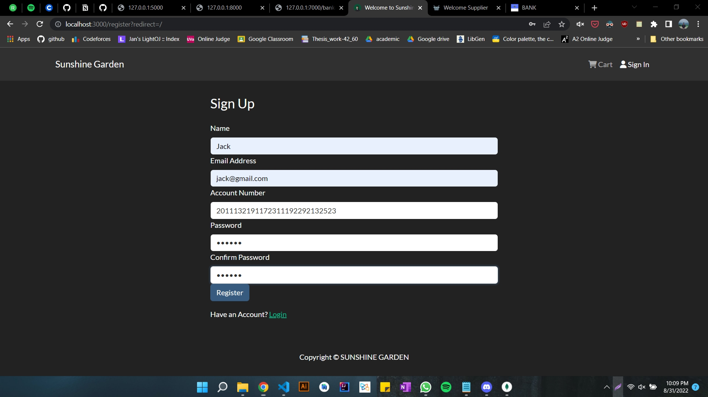
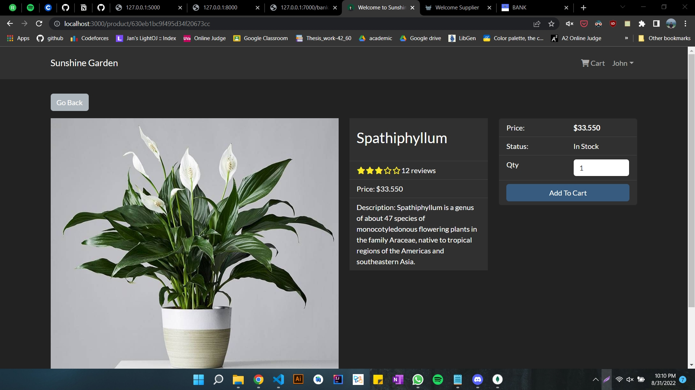
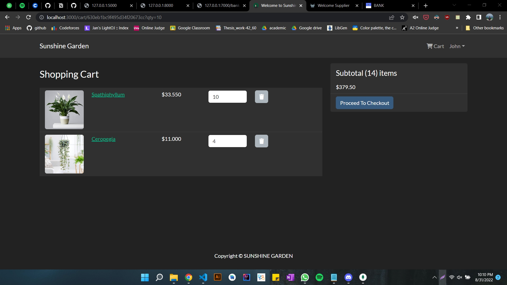

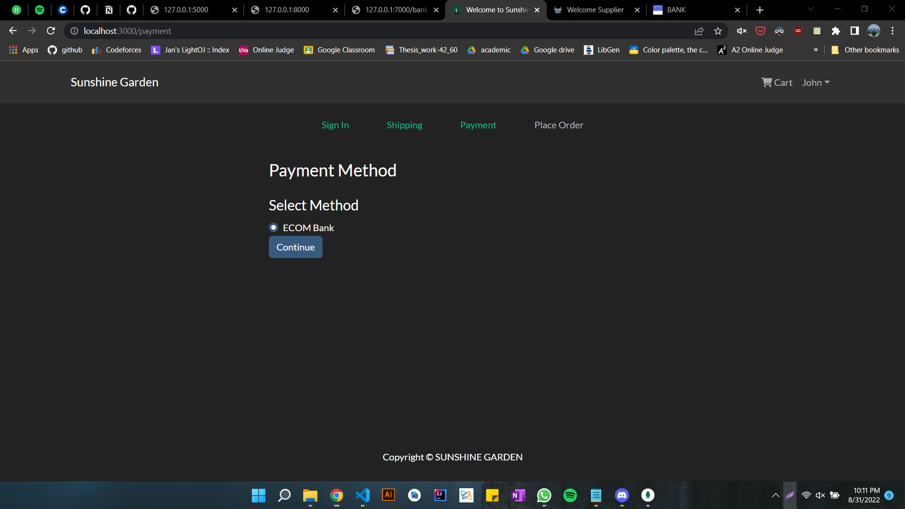
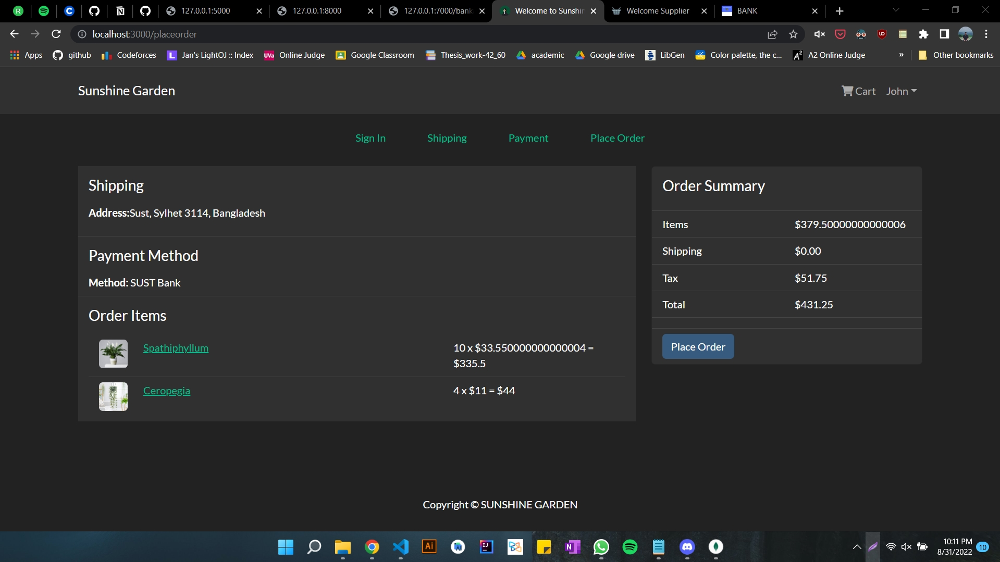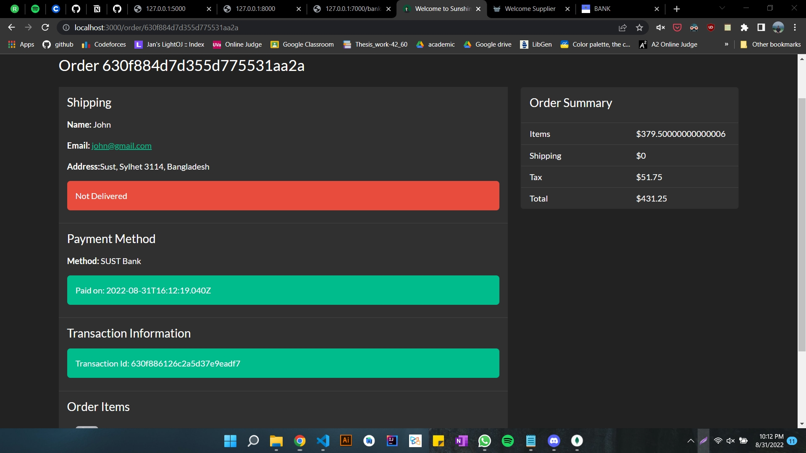
</br></br>

## Supplier:


</br></br>

## Bank:

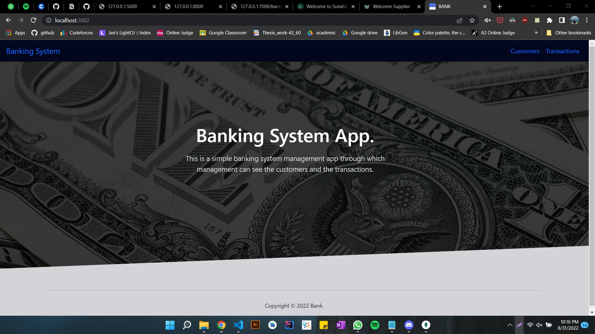
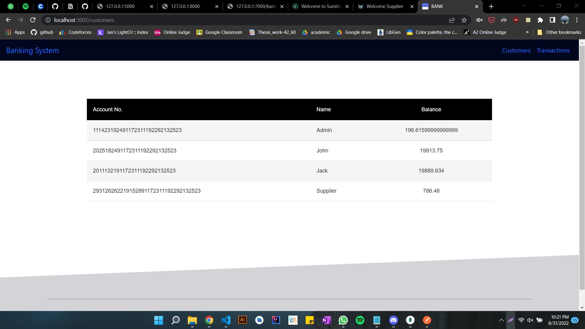
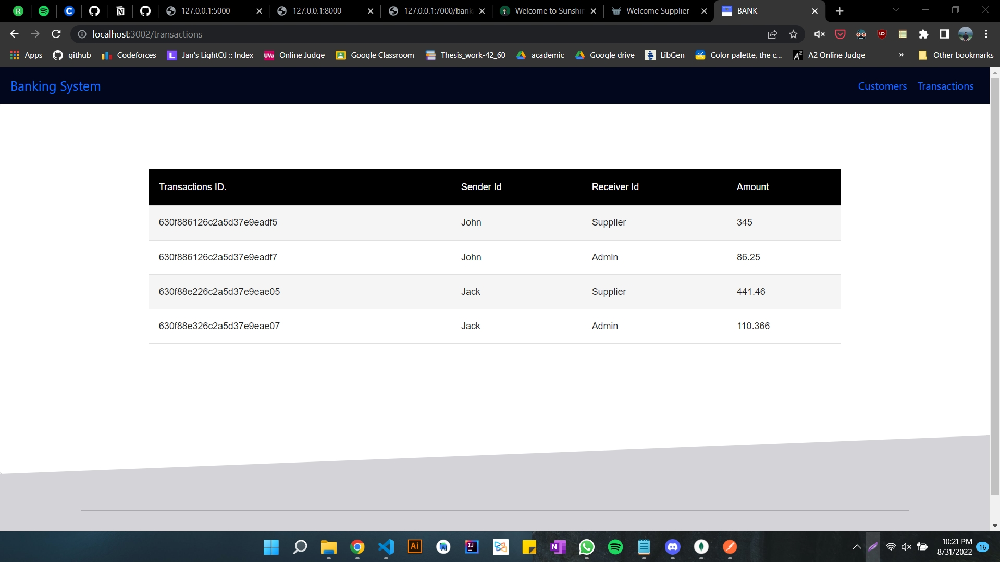
